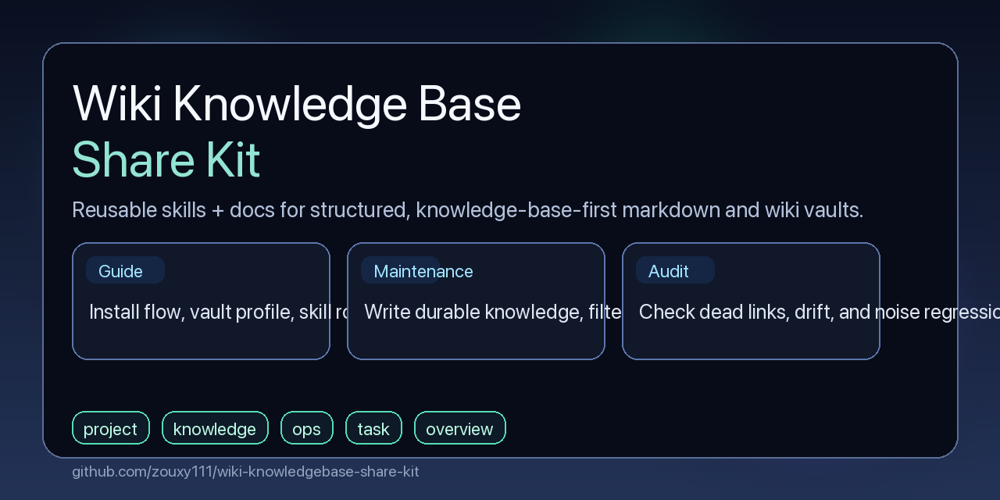

# Wiki Knowledge Base Share Kit

[](https://github.com/zouxy111/wiki-knowledgebase-share-kit/releases)
[](https://github.com/zouxy111/wiki-knowledgebase-share-kit/actions/workflows/validate.yml)
[](https://github.com/zouxy111/wiki-knowledgebase-share-kit/stargazers)
[](https://github.com/zouxy111/wiki-knowledgebase-share-kit/forks)
[](https://github.com/zouxy111/wiki-knowledgebase-share-kit/graphs/contributors)
[](./LICENSE)

> An **8-skill knowledge-base package** for markdown / wiki / Obsidian-style vaults.  
> The goal is not to record more logs, but to keep a vault **navigable, role-stable, maintainable, collaboration-friendly, and auditable**.

<p align="center">
  <a href="https://zouxy111.github.io/wiki-knowledgebase-share-kit/"></a>
  <a href="./START-HERE.md"></a>
  <a href="https://github.com/zouxy111/wiki-knowledgebase-share-kit/releases"></a>
</p>

[](https://zouxy111.github.io/wiki-knowledgebase-share-kit/)

> If you want the more product-like HTML landing page, open the **HTML Homepage** above; the repository README continues to handle installation, routing, and method documentation.

---

## 30-second overview

Many vault problems are not caused by a lack of writing. They come from structure drift:
- too much content without stable entrypoints
- root pages turning into process logs
- long-form sources, meeting notes, and task conclusions getting mixed together
- new collaborators not knowing where to start or which workflow to use

This kit is designed to shift a vault toward the following state:

| Typical problem | Target state |
|---|---|
| Root pages become timeline dumps | Root pages return to navigation, stable boundaries, and topic entrypoints |
| Long documents are hard to reuse after import | Sources are split into overview / chapter / topic structures with lineage preserved |
| Durable conclusions only exist in chat or meetings | Reusable conclusions are written back into the right pages |
| The vault drifts but nobody knows where it is broken | Audit checks dead links, orphan pages, boundary drift, and noise regression |
| Collaboration context is fragmented and hard to hand off | Working profile, team coordination, and journal workflows create a stable collaboration surface |

In one sentence:

> Make your markdown repository behave like a real knowledge base instead of a pile of notes you wrote once and cannot reliably find later.

---

## This is an 8-skill package

The current public package contains 8 skills:

1. `knowledge-base-kit-guide`
2. `knowledge-base-orchestrator`
3. `knowledge-base-ingest`
4. `knowledge-base-maintenance`
5. `knowledge-base-audit`
6. `knowledge-base-working-profile`
7. `knowledge-base-team-coordination`
8. `work-journal`

Together they cover 7 capability tracks:
- **Onboarding / Orchestration**
- **Ingest**
- **Maintenance**
- **Audit**
- **Working profile**
- **Team coordination**
- **Work journal**

In particular:
- `knowledge-base-kit-guide` explains installation, profile setup, and skill routing
- `knowledge-base-orchestrator` provides low-friction onboarding: inspect the current environment, create a vault skeleton, generate a profile, and route the user to the next specialist skill

> `knowledge-base-orchestrator` is an **onboarding coordinator**, not a universal autonomous agent.

---

## Best fit

### Good fit
- Individuals or teams already maintaining a markdown / wiki / Obsidian-style vault
- People who want to separate execution history from durable knowledge
- Users who accept the fixed page-role model: `project / knowledge / ops / task / overview`
- Teams that want stable workflows for long-form ingest, maintenance, audit, working profile, shared-project coordination, and work journaling

### Not a good fit
- People who do not want to configure a `vault profile`
- Log-first vaults that do not care about navigation or governance
- Users expecting the package to run as a background fully automatic system
- Setups that reject the fixed page-role model entirely

---

## Core model: 5 fixed page roles

This method uses **5 fixed page roles**:

| Role | Purpose | What it should not carry |
|---|---|---|
| `project` | project navigation, overview, boundaries | long chronological narration, raw chat history |
| `knowledge` | methods, concepts, reusable knowledge | “what I did today” style process notes |
| `ops` | troubleshooting, operational procedures, boundary rules | one-off fix playback |
| `task` | todo items, assignments, in-progress work | long-term knowledge |
| `overview` | vault homepage, governance rules, indexes | detailed project history |

Additional note:
- `work-journal` is a **separate workflow**, not a sixth fixed page role
- journal content should be filtered before it is promoted into `knowledge`, `ops`, `project`, or other stable pages

---

## Why this method works

It relies on a few fixed rules:

1. **Knowledge-base-first**: keep durable knowledge, filter one-off noise
2. **Fixed role model**: each page has a clear job
3. **Four-sync mechanism**: substantive updates should sync the target page, root page, `index.md`, and `log.md`
4. **Milestone-only log**: `log.md` should record milestones, not task playback
5. **Periodic audit**: structure, navigation, metadata, and noise regression should be checked on a regular basis

---

## Recommended scenario: high-knowledge-density, multi-person, auditable collaboration

This kit is particularly strong in a class of environments that are:

> **knowledge-dense, frequently updated, collaboration-heavy, and in need of traceability and auditability.**

That includes, but is not limited to:
- medical / pathology / research work
- enterprise knowledge bases / project delivery / operational documentation
- cross-team collaboration / onboarding / meeting conclusion distillation

These settings look different, but the underlying problems are often similar:

| Shared problem | In medical / research work | In enterprise / team work |
|---|---|---|
| Long-form sources are hard to reuse | guidelines, textbooks, papers, case summaries are hard to retrieve | PRDs, solution docs, runbooks, and meeting materials are hard to revisit |
| Experience is scattered | clinical or research experience lives in fragmented notes | project experience is scattered across chat, meeting notes, and temporary docs |
| Collaboration is complex | advisors, colleagues, and collaborators are hard to keep aligned | cross-functional teams keep repeating context and background |
| Boundaries and auditability matter | content cannot be mixed casually and updates must stay controlled | governance needs clear navigation, ownership, and audit findings |

So this is better understood as **one method for high-knowledge-density collaboration**, not as separate “medical” and “enterprise” products.

---

## How the kit is used in that scenario

### 1. Import long-form sources, books, guidelines, or plans
Use `knowledge-base-ingest` to:
- read the `vault profile`
- split the source into overview / chapter / topic pages
- generate TOC, glossary candidates, and related-link suggestions
- treat the first import as a **testable baseline** and improve it through iteration and regression checks

Typical examples:
- medical books, guidelines, papers
- enterprise SOPs, PRDs, delivery docs, training materials

### 2. Distill durable task results and meeting conclusions
Use `knowledge-base-maintenance` to:
- extract stable conclusions from tasks, meetings, conversations, or deliverables
- filter one-off process noise
- update the target page and the related navigation surfaces

### 3. Perform periodic structural governance
Use `knowledge-base-audit` to:
- inspect dead links, orphan pages, and missing entrypoints
- detect page-boundary drift, metadata issues, and stray root-level files
- report traceable P1 / P2 / P3 findings

### 4. Maintain collaboration context and shared-project structure
Use:
- `knowledge-base-working-profile`
- `knowledge-base-team-coordination`
- `work-journal`

The goal here is **not** to create a private dossier. The goal is to:
- distill stable signals that matter for future collaboration
- separate `confirmed / repeated / inferred` items
- filter sensitive personal data and anything that should not be stored long term
- keep draft / approved boundaries in shared coordination workflows

---

## Working profile boundaries matter

`knowledge-base-working-profile` maintains a **working profile**, not a personal surveillance record.

It focuses on:
- stable preferences
- decision heuristics
- collaboration boundaries
- anti-patterns
- stable signals that directly improve future collaboration

It should not retain by default:
- highly sensitive personal data
- private details unrelated to future collaboration
- third-party private information
- strong unconfirmed inference
- one-off emotional reactions

In team, medical, or otherwise sensitive settings, the README should make these boundaries explicit:
- consent
- visibility
- share only what is necessary
- confirm first, then promote to durable profile material

---

## Recommended usage order

### If you are completely new
1. Start with `START-HERE.md`
2. Prepare `templates/vault-profile-template.md`
3. Use `knowledge-base-orchestrator` for onboarding
4. Then move into the relevant specialist skill

### If you want to understand the method first
1. Start with `knowledge-base-kit-guide`
2. Understand the profile, role model, and routing
3. Then choose ingest / maintenance / audit / working-profile / team-coordination / journal as needed

### If you already know what you need
Go directly to the relevant specialist skill:
- long-form import: `knowledge-base-ingest`
- durable maintenance: `knowledge-base-maintenance`
- structural review: `knowledge-base-audit`
- collaboration profile update: `knowledge-base-working-profile`
- shared-project coordination: `knowledge-base-team-coordination`
- daily work logging: `work-journal`

---

## Installation

Start with the general rule:

> The package is fundamentally a set of **8 `SKILL.md`-style skill bundles**.  
> If your AI platform supports a similar skills directory structure, you can install it. Directory locations vary by platform.

Common examples:

```bash
cp -r skills/knowledge-base-kit-guide ~/.codex/skills/
cp -r skills/knowledge-base-orchestrator ~/.codex/skills/
cp -r skills/knowledge-base-ingest ~/.codex/skills/
cp -r skills/knowledge-base-maintenance ~/.codex/skills/
cp -r skills/knowledge-base-audit ~/.codex/skills/
cp -r skills/knowledge-base-working-profile ~/.codex/skills/
cp -r skills/knowledge-base-team-coordination ~/.codex/skills/
cp -r skills/work-journal ~/.codex/skills/
```

Other common directory patterns include:
- `~/.codex/skills`
- `~/.claude/skills`
- or another platform-specific location for `SKILL.md` bundles

> If you are using OpenClaw, Hermes Agent, Claude Code, or another compatible platform, confirm that platform’s skill-directory convention before installation.

---

## OpenClaw / Hermes / MinerU compatibility notes

This method often pairs well with:
- **OpenClaw** as a day-to-day AI assistant platform
- **Hermes Agent** as a long-running collaboration-oriented agent platform
- **MinerU** as a PDF / complex-document to markdown conversion tool

But the important boundary is:
- these are **recommended combinations**, not exclusive dependencies
- the core value of this repository is still **knowledge-base structure governance and workflow design**, not platform lock-in

---

## Quick start

```bash
# 1. Clone the repository
git clone https://github.com/zouxy111/wiki-knowledgebase-share-kit.git
cd wiki-knowledgebase-share-kit

# 2. Read the onboarding entrypoint
cat START-HERE.md

# 3. Copy the template and prepare your profile
cp templates/vault-profile-template.md ./my-vault-profile.md
```

Once your platform and skill directory are ready, install the 8 skill bundles.

---

## FAQ

**Q: Can I use this without Obsidian?**  
A: Yes. If you have a markdown/wiki vault and a platform that supports the relevant skill structure, you can use it.

**Q: Can I use it without full automation?**  
A: Yes. The docs, templates, and checklists are still usable manually; the skills mainly improve execution efficiency.

**Q: My vault is already messy. Can I still adopt this?**  
A: Yes. Start with an audit, then fix structure, repair navigation, and tighten page boundaries incrementally.

**Q: Are enterprise and medical separate solutions?**  
A: No. They are two common variants of the same broader scenario: high-knowledge-density, multi-person, auditable collaboration.

**Q: Will the working profile become a privacy dossier?**  
A: It should not. The intended use is to keep collaboration-relevant stable signals while enforcing consent, visibility, and sensitive-data filtering boundaries.

---

## Read these first

- `START-HERE.md`
- `GLOSSARY.md`
- `templates/vault-profile-template.md`
- `docs/example-prompts.md`
- `docs/usage-sop.md`
- `examples/case-study-pathology-ingest-iteration.md`

---

## Need help?

- [GitHub Issues](https://github.com/zouxy111/wiki-knowledgebase-share-kit/issues)
- Developers: 邹星宇, 杨琦

---

## License

MIT License

---

> If you want your vault to behave more like a knowledge base and less like a note dump, start with `START-HERE.md`.
